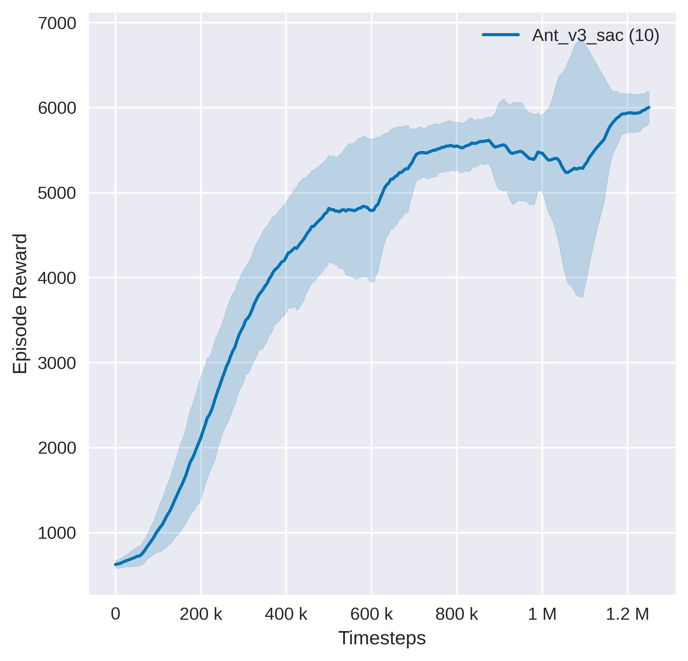

  

---

This repo only servers as a link to Tianshou's benchmark of Mujoco environments. Latest benchmark is maintained under [thu-ml/tianshou](https://github.com/thu-ml/tianshou), See full benchmark [here](https://github.com/thu-ml/tianshou/tree/master/examples/mujoco).

**Keywords**: deep reinforcement learning, pytorch, mujoco, benchmark, performances, Tianshou, baseline

# Tianshou's Mujoco Benchmark

We benchmarked Tianshou algorithm implementations in 9 out of 13 environments from the MuJoCo Gym task suite.

For each supported algorithm and supported mujoco environments, we provide:
- Default hyperparameters used for benchmark and scripts to reproduce the benchmark;
- A comparison of performance (or code level details) with other open source implementations or classic papers;
- Graphs and raw data that can be used for research purposes;
- Log details obtained during training;
- Pretrained agents;
- Some hints on how to tune the algorithm.
  

Supported algorithms are listed below:
- [Deep Deterministic Policy Gradient (DDPG)](https://arxiv.org/pdf/1509.02971.pdf), [commit id](https://github.com/thu-ml/tianshou/tree/e605bdea942b408126ef4fbc740359773259c9ec)
- [Twin Delayed DDPG (TD3)](https://arxiv.org/pdf/1802.09477.pdf), [commit id](https://github.com/thu-ml/tianshou/tree/e605bdea942b408126ef4fbc740359773259c9ec)
- [Soft Actor-Critic (SAC)](https://arxiv.org/pdf/1812.05905.pdf), [commit id](https://github.com/thu-ml/tianshou/tree/e605bdea942b408126ef4fbc740359773259c9ec)
- [REINFORCE algorithm](https://papers.nips.cc/paper/1999/file/464d828b85b0bed98e80ade0a5c43b0f-Paper.pdf), [commit id](https://github.com/thu-ml/tianshou/tree/v0.4.0)

## Example benchmark
### SAC

|      Environment       |      Tianshou      | [SpinningUp (Pytorch)](https://spinningup.openai.com/en/latest/spinningup/bench.html) | [SAC paper](https://arxiv.org/abs/1801.01290) |
| :--------------------: | :----------------: | :-------------------: | :---------: |
|          Ant           |  **5850.2±475.7**  |         ~3980         |    ~3720    |
|      HalfCheetah       | **12138.8±1049.3** |        ~11520         |   ~10400    |
|         Hopper         |  **3542.2±51.5**   |         ~3150         |    ~3370    |
|        Walker2d        |  **5007.0±251.5**  |         ~4250         |    ~3740    |
|        Swimmer         |    **44.4±0.5**    |         ~41.7         |      N      |
|        Humanoid        |  **5488.5±81.2**   |           N           |    ~5200    |
|        Reacher         |    **-2.6±0.2**    |           N           |      N      |
|    InvertedPendulum    |   **1000.0±0.0**   |           N           |      N      |
| InvertedDoublePendulum |   **9359.5±0.4**   |           N           |      N      |

## Other resources
- [Spinningup Benchmark](https://spinningup.openai.com/en/latest/spinningup/bench.html)
- [OpenAI Baseliens Benchmark](https://htmlpreview.github.com/?https://github.com/openai/baselines/blob/master/benchmarks_mujoco1M.htm)
- TODO and relative discussions: [1](https://github.com/thu-ml/tianshou/issues/274), [2](https://github.com/thu-ml/tianshou/issues/307)

